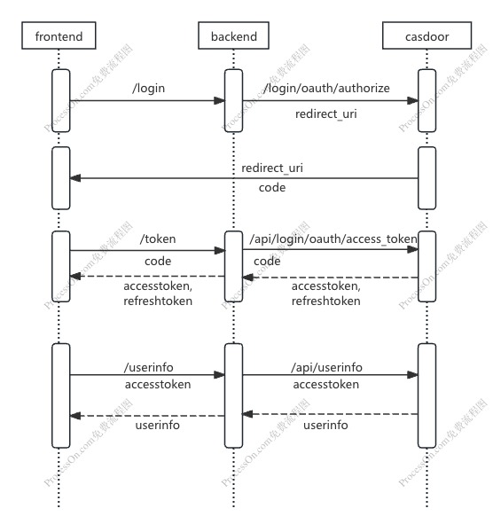

# OAuth2 with Casdoor Demo

## backend
http://localhost:9000

Run by
```
go run main.go
```

## frontend
http://localhost:8080

Run by
```
cd frontend 
npm install
vue serve
```

## casdoor
http://localhost:8000

Run by
```
docker run -p 8000:8000 casbin/casdoor-all-in-one
```
Login to the casdoor management platform and do as follows:
1. Add a new application to obtain `Client ID` and `Client secret`
2. Add a new user like `guobin`

> https://github.com/casdoor/casdoor

## workflow

